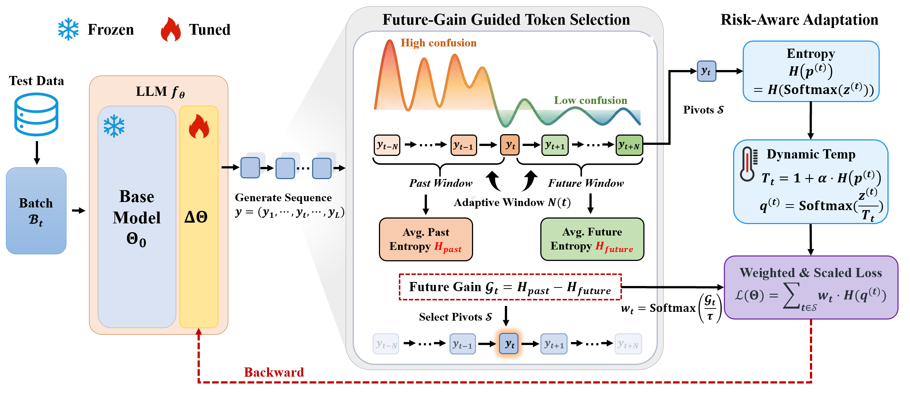

<h1 align="center">
  <br>
  Future-Gain Guided Test-Time Learning for Large Language Models

<p align="center">
  <a href="">
    
  </a>
  <a href="https://www.python.org/">
    
  </a>
  <a href="https://github.com/hiyouga/LLaMA-Factory">
    
  </a>
</p>

</h1>

<a id="introduction"></a>

## 🌟 Introduction

**FG-TTL** is an online test-time learning method for large language models.

It selectively learns from informative generated tokens that reduce future uncertainty and stabilizes the adaptation process through risk-aware update control.

<a id="framework"></a>

## 🧩 Framework

The overall framework of FG-TTL is shown below.

<p align="center">
  
</p>

If the figure is not displayed correctly, please make sure the following file exists:

```text
figure/freamwork.png
```

<a id="contents"></a>

## 📚 Contents

- [🌟 Introduction](#introduction)
- [🧩 Framework](#framework)
- [🚀 Quick Start](#quick-start)
- [🏃 Running FG-TTL](#running-fg-ttl)
- [🤖 Running on Other Models](#running-on-other-models)
- [📊 Evaluation](#evaluation)
- [📝 Notes](#notes)
- [📌 Citation](#citation)

<a id="quick-start"></a>

## 🚀 Quick Start

### 1. Clone Our Repo

```bash
git clone https://github.com/BianLangyu/FG-TTL.git
cd FG-TTL
```

### 2. Install FG-TTL Environment

```bash
conda create -n fg_ttl python=3.10 -y
conda activate fg_ttl

pip install -e ".[torch,metrics]" --no-build-isolation
```

<a id="running-fg-ttl"></a>

## 🏃 Running FG-TTL

We provide configuration files for running FG-TTL on six mathematical reasoning benchmarks.

The following commands run FG-TTL with **Llama3.1-8B**.

| Dataset | Command |
| :--- | :--- |
| GSM8K | `CUDA_VISIBLE_DEVICES=0 llamafactory-cli train examples/FG_TTL/Llama3.1-8B/gsm8k.yaml` |
| AIME | `CUDA_VISIBLE_DEVICES=0 llamafactory-cli train examples/FG_TTL/Llama3.1-8B/aime.yaml` |
| CollegeMath | `CUDA_VISIBLE_DEVICES=0 llamafactory-cli train examples/FG_TTL/Llama3.1-8B/collegemath.yaml` |
| MATH-500 | `CUDA_VISIBLE_DEVICES=0 llamafactory-cli train examples/FG_TTL/Llama3.1-8B/math500.yaml` |
| Minerva | `CUDA_VISIBLE_DEVICES=0 llamafactory-cli train examples/FG_TTL/Llama3.1-8B/minerva.yaml` |
| OlympiadBench | `CUDA_VISIBLE_DEVICES=0 llamafactory-cli train examples/FG_TTL/Llama3.1-8B/olympiad.yaml` |

You can also run them directly as follows:

```bash
CUDA_VISIBLE_DEVICES=0 llamafactory-cli train examples/FG_TTL/Llama3.1-8B/gsm8k.yaml
CUDA_VISIBLE_DEVICES=0 llamafactory-cli train examples/FG_TTL/Llama3.1-8B/aime.yaml
CUDA_VISIBLE_DEVICES=0 llamafactory-cli train examples/FG_TTL/Llama3.1-8B/collegemath.yaml
CUDA_VISIBLE_DEVICES=0 llamafactory-cli train examples/FG_TTL/Llama3.1-8B/math500.yaml
CUDA_VISIBLE_DEVICES=0 llamafactory-cli train examples/FG_TTL/Llama3.1-8B/minerva.yaml
CUDA_VISIBLE_DEVICES=0 llamafactory-cli train examples/FG_TTL/Llama3.1-8B/olympiad.yaml
```

<a id="running-on-other-models"></a>

## 🤖 Running on Other Models

For the other two model backbones, the running procedure is the same.

Simply replace the model directory in the YAML path with the corresponding model name.

For example, the configuration directory of **Llama3.1-8B** is:

```text
examples/FG_TTL/Llama3.1-8B/
```

For other models, use the corresponding configuration directories:

```text
examples/FG_TTL/Qwen2.5-7B/
examples/FG_TTL/Phi-4-14B/
```

The general command format is:

```bash
CUDA_VISIBLE_DEVICES=0 llamafactory-cli train examples/FG_TTL/{MODEL_NAME}/{DATASET_NAME}.yaml
```

where `{DATASET_NAME}` can be one of:

```text
gsm8k
aime
collegemath
math500
minerva
olympiad
```

Examples:

```bash
CUDA_VISIBLE_DEVICES=0 llamafactory-cli train examples/FG_TTL/Qwen2.5-7B/gsm8k.yaml
CUDA_VISIBLE_DEVICES=0 llamafactory-cli train examples/FG_TTL/Phi-4-14B/math500.yaml
```

<a id="evaluation"></a>

## 📊 Evaluation

### 1. Install Evaluation Dependency

```bash
conda install -c conda-forge antlr-python-runtime=4.11 -y
```

Alternatively, you can use pip:

```bash
pip install antlr4-python3-runtime==4.11.*
```

### 2. Specify Prediction Path

The evaluation script is located at:

```text
src/llamafactory/eval/cal_acc.py
```

Before evaluation, specify the generated prediction file path in `cal_acc.py`.

For example:

```python
paths = [
    "path/to/generated_predictions.jsonl"
]
```

### 3. Run Evaluation

```bash
cd src/llamafactory
python -m eval.cal_acc
```

The output format is:

```text
total {num_samples} samples, acc: {acc}
```

<a id="notes"></a>

## 📝 Notes

- Change `CUDA_VISIBLE_DEVICES=0` if you want to use another GPU.
- Make sure the YAML configuration file matches the model and dataset you want to evaluate.
- Make sure the generated prediction file is correctly specified in `cal_acc.py`.
- For OlympiadBench evaluation, the auxiliary file is used:

```text
eval/OE_TO_maths_physics_en_COMP.json
```

<a id="citation"></a>

## 📌 Citation

If you find this repository useful, please consider citing our work.

```bibtex

```